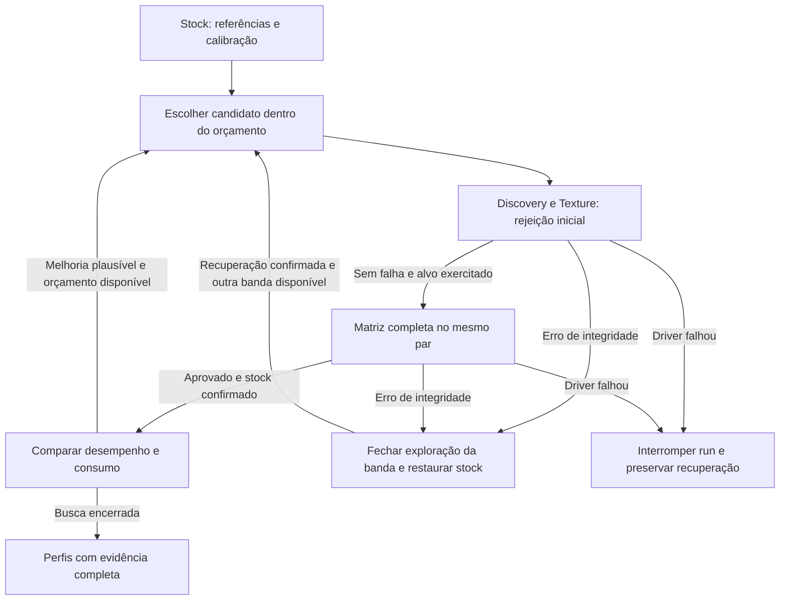

# Descoberta com qualificação completa

Proposta de 2026-09-18 aceita pelo usuário; implementação de 2026-09-24.
**Implementada e verificada em software; aceitação física pendente.**
Solicitação: melhorar a precisão da triagem e reduzir interrupções por TDR, aceitando
mais tempo por candidato. O objetivo continua sendo descobrir os três perfis a partir
de Full Reset → Clean Run, sem usar o 1800@875 manual como alvo ou conhecimento inicial.

## 1. Diagnóstico que fundamenta a mudança

A última run passou 1890@875 em Discovery e Texture curtos. O incidente seguinte foi
em **1890@868**, durante Texture, antes de qualquer matriz final. Portanto, ainda não
há prova de falso passe de 1890@875, nem de reprovação tardia desse mesmo par no
Endurance. O histórico está em [clean-run-results-2026-09-18.md](clean-run-results-2026-09-18.md).

O algoritmo anterior reduzia a tensão após cada passe curto, procurando a primeira falha
de cada clock. Mesmo uma triagem mais forte continua sujeita a provocar um TDR no
próximo ponto desconhecido. Precisamos modificar tanto o teste quanto a decisão de
continuar explorando.

A auditoria encontrou diferenças concretas:

| Aspecto | Frontier anterior, Standard | Endurance, Standard |
|---|---|---|
| Duração programada | 30 s de Texture após Discovery de 10 s | 300 s contínuos |
| Plano Vulkan | 13 segmentos | 23 segmentos |
| Parcela nominal HeavySpike | 3% | aproximadamente 27% |
| Parcela nominal CompositeGameLoad | 50% | aproximadamente 16% |
| ComputeBurst explícito | Sim | Não |

São distribuições diferentes das mesmas primitivas. Alongar Texture não reproduz
automaticamente Endurance; substituí-lo inteiramente perderia cobertura de compute.
Os planos também escalam os segmentos proporcionalmente: executar 30 s e depois
270 s não constitui uma execução contínua de Endurance de 300 s.

A auditoria identificou duas fragilidades no caminho de concorrência entre contextos,
agora corrigidas:

- O verificador secundário iniciava sob o candidato com `goldens=None`: compara com
  seu primeiro resultado. Isso pode aceitar uma saída consistentemente errada.
  A carga principal já recebe referências obtidas em stock.
- Uma falha do secundário só era incorporada depois de a fase principal terminar e
  realizar `join`, sem solicitar imediatamente a parada da carga principal.

Nenhuma dessas fragilidades foi demonstrada como causa específica do reinício:
a observação final de 868 mV não chegou a ser gravada.

## 2. Fluxo implementado

**Avaliar menos pares com a matriz completa antes de permitir refinamento.**
Para a primeira versão, reaproveitar a bateria existente, sua ordem e seus critérios,
em vez de inventar uma carga curta e atribuir a ela confiança equivalente.

Fluxo:

### Teste de cada candidato

1. Aplicar o par exato com o protocolo existente de BootFlag, contenção de clock,
   leitura de tensão e restauração. Discovery/Texture continuam úteis para rejeitar
   rapidamente; passar essa etapa significa apenas **elegível para qualificação**.
2. Executar a matriz Standard integral: **DX11 7 min → Vulkan 2 min → DX12 2 min →
   Endurance 5 min**. Preservar as coberturas de compute, integridade, transições,
   exposição ao alvo, temperatura e confirmação de limpeza de cada transação.
3. Somente a conclusão integral permite incluir o par na seleção de perfis ou usá-lo
   como base qualificada para uma tentativa de menor tensão/maior clock. A preparação
   excepcional de um candidato limitado por potência tem regra própria abaixo e não
   produz evidência de estabilidade.
4. Reutilizar a prova completa para esse mesmo par ao gerar os perfis, dentro da mesma
   run, modo e proveniência válidos. Não repetir a matriz apenas porque mudou a etapa
   da interface. Um incidente posterior deve passar pelas regras de invalidação e
   recuperação existentes antes de qualquer Apply/publicação.

O modo Long mantém suas durações integrais; não chamar Standard de equivalente a
Long. A proposta não altera silenciosamente os contratos atuais de publicação.
Mudanças nas referências/detecção exigem atualizar fingerprints/versões pertinentes,
impedindo que evidência antiga satisfaça uma garantia nova.

### Busca dos pontos

- Partir da curva real e da calibração stock da própria GPU. Falha de integridade em
  stock impede a busca; referência ausente ou contraditória não vira aprovação.
- Usar o envelope admissível obtido da curva/calibração stock para escolher três bandas
  de exploração: maior desempenho, faixa intermediária e menor consumo. Admissível
  ainda não significa qualificado; não depender da busca de fronteira antiga para
  inicializar essas bandas. Elas organizam candidatos; os três perfis são escolhidos
  posteriormente entre todos os pares qualificados. Persistir a identidade das bandas
  para não reabrir uma região encerrada quando o maior clock qualificado mudar.
- Começar por candidatos conservadores derivados dessa curva. A interpolação pode
  ordenar tentativas; nunca certifica um par que ainda não foi testado.
- Após uma qualificação, refinar uma variável por vez: um bin físico de tensão abaixo
  ou um bin de clock acima. Só investir em uma região que ainda possa melhorar algum
  perfil segundo a comparação comum de desempenho/potência. Não varrer cada clock
  de 15 MHz até descobrir sua primeira falha.
- Um clock menor ou uma margem maior de tensão também precisam de teste no par
  efetivamente publicado. Não aplicar uma suposta margem depois da qualificação.
- Continuar usando potência medida na mesma carga de comparação para todos os pares;
  pico de stress permanece diagnóstico separado. Clock/W continua sendo uma aproximação
  de eficiência, não uma medição de FPS em jogos.

**Entrada limitada por potência:** `PowerBoundClockDrop` não prova estabilidade nem
instabilidade. Se a limitação de potência estiver confirmada, sem erro de integridade,
escape do teto de clock ou falha térmica, e com cleanup confirmado, permitir **uma
única tentativa preparatória de um bin de tensão menor por banda**. Ela consome o
orçamento e deve passar pelos testes completos no novo par antes de autorizar qualquer
refinamento. Se continuar sem sustentar o alvo,
encerrar a banda; não criar uma escada ilimitada de inconclusivos. Falta de telemetria
ou residência sem causa confirmada não habilita essa exceção.

### Orçamento e encerramento implementados

- **Até 24 admissões de candidato por run**, incluindo recusas na etapa curta,
  preparação por potência e tentativas canceladas. As três bandas alternam suas
  admissões; uma banda encerrada deixa de participar. O contador é gravado, sincronizado
  e relido antes de armar o candidato. Falha de persistência impede essa aplicação.
- **Janela planejada de até 8 horas no Standard**, incluindo preparação e cleanup.
  Não iniciar candidato cuja matriz completa estimada não caiba no tempo restante.
  Long amplia o orçamento proporcionalmente às durações integrais da sua matriz.
  Esse limite não garante o tempo de encerramento se o driver bloquear.
- Um erro de integridade fecha a banda. Dois erros fecham a busca inteira. Um TDR,
  perda do dispositivo ou falha operacional de segurança interrompe a run inteira.
  Depois de TDR, esta nova busca não oferece Resume: preservar recuperação e revisar
  o relatório antes de uma nova run. Não reabrir a banda trocando apenas seu clock.
- `Inconclusive` fecha a banda sem aumentar tensão, repetir automaticamente ou escrever
  blacklist. O único passo preparatório permitido por potência confirmada consome uma
  admissão e não aprova o par anterior. Cada fase curta e cada lane da matriz executam
  uma única tentativa. Cancelamento manual com stock confirmado permite Resume, mantendo
  os contadores e cobrando nova admissão se for preciso repetir um candidato.
- As bandas começam em aproximadamente 100%,95% e90% do clock stock sustentado, usando
  bins físicos e offsets admissíveis a partir de zero. A banda de desempenho alterna
  menor tensão e maior clock após prova completa. As econômicas procuram menor tensão;
  se ficarem abaixo de90% do desempenho já qualificado, avançam um clock físico por vez
  na última tensão qualificada. Cada avanço exige sua própria matriz e usa o mesmo
  orçamento; uma banda fechada nunca é reaberta.
- Exclusões de política não são falhas físicas dos vizinhos. Cada par publicado exige
  sua própria prova atual, da mesma run/GPU, incluindo recuperação confirmada. A busca
  finita não declara o domínio econômico inteiro explorado.

**Por que24/8h:** o replay aritmético salvo em
`target/beta/qualified-discovery-20260919/replay-reach.json` mostrou que12 admissões,
com as três bandas abertas, permitem só quatro tentativas por banda. Partindo do stock
histórico1755MHz, a alternância conservadora chegaria a1770MHz nesse cenário hipotético.
Com24, permite oito tentativas por banda e até1800MHz se todas as provas anteriores
passassem. Esses valores ilustram o alcance, não são alvos codificados nem aprovações
fabricadas. Ajustes de clock nas bandas econômicas consomem tentativas que poderiam
ser usadas para baixar tensão. Os dados antigos não possuem a curva stock completa;
a implementação sempre captura a curva atual da própria GPU.

Vinte e quatro matrizes Standard somam384 minutos de carga programada, antes da
triagem e das transações. Essa conta dimensiona o limite; não prevê a duração medida
nem promete alcançar o boost máximo ou os três ótimos. O tempo da run é independente
da cota de5h do Codex; o programa não depende do agente para executar ou se encerrar.

O custo assumido é deixar de encontrar alguns pontos extremos. O resultado pretendido
é o melhor conjunto demonstrado dentro do orçamento, sem alegar ótimo global ou forçar
três configurações diferentes quando só uma/duas foram qualificadas.

## 3. Motor de teste e recuperação

Correções incorporadas:

1. O verificador secundário recebe a referência TextureRop validada em stock para sua
   carga/backend. Seu device independente é criado a partir do mesmo adapter do primário.
   Referência ausente não vira passe. Os fingerprints Texture/Endurance agora são r4;
   Frontier29 e ExactApply32 impedem reaproveitar qualificação do contrato anterior.
2. Os verificadores compartilham cancelamento para cessar novas submissões
   assim que uma corrupção/perda de dispositivo for detectada. Preservar o veredito
   mais grave; o cancelamento provocado pelo erro não pode esconder `SilentError`/crash.
3. Ambos os workers encerram e são reunidos antes do retorno, incluindo falha/panic
   do primário. Pedido de Stop não equivale a
   worker encerrado, stock restaurado ou BootFlag liberado. Não iniciar um reset em
   paralelo a operações ainda em execução no driver.
4. Manter o Core e a UI informados sobre parada/recuperação pendente. Se o diagnóstico
   das esperas exigir isolamento do worker, avaliar isso como alteração operacional
   separada. Um processo separado não isola o driver de kernel nem impede bugcheck.

Essas correções aumentam a capacidade de reagir a um erro detectável. Uma GPU ainda
pode travar antes de produzir um checksum errado. O mecanismo de TDR pertence ao
Windows/driver; não existe promessa de prevenção integral em espaço de usuário.
Referências oficiais: [WDDM TDR](https://learn.microsoft.com/en-us/windows-hardware/drivers/display/timeout-detection-and-recovery)
e [chaves de TDR destinadas a teste de driver](https://learn.microsoft.com/en-us/windows-hardware/drivers/display/tdr-registry-keys).
Não alterar essas chaves como solução do algoritmo.

## 4. Entregas e aceitação

| Entrega | Escopo | Evidência necessária |
|---|---|---|
| 1. Integridade e parada | Referência stock no secundário, propagação imediata de falha e preservação do veredito | Testes de saída inicial errada, falha concorrente, cancelamento e cleanup incompleto; nenhuma aprovação sem referência |
| 2. Qualificar antes de refinar | Usar matriz existente em cada candidato elegível; retirar do passe curto a autorização de descida | Replay: Texture sozinho nunca libera o próximo bin; só prova completa e limpeza confirmada liberam |
| 3. Busca limitada por perfis | Bandas derivadas de stock, preparação sob limite de potência, orçamento persistente e parada por erro | Replay de alcance e da sequência de 18/09; orçamento não reinicia no Resume; censura não escreve blacklist; Full Reset esquece tudo |
| 4. Fluxo compreensível | Mostrar triagem, qualificação, perfil disponível e motivo da parada | UI não chama passe curto de perfil estável; informa cobertura incompleta sem fabricar três perfis |
| 5. Verificação física limitada | Run manual pelo BAT, Full Reset e Clean; exportação automática suficiente para revisão | Tempos, pares testados, erros, TDRs, cobertura, restauração e perfis publicados com prova completa |

Os testes de software verificam a política e os contratos, não a estabilidade elétrica.
Na validação física, interromper a campanha no primeiro TDR para revisar a evidência;
não reproduzir deliberadamente 1890@868 nem acumular crashes para estimar uma taxa.
Comparar com o histórico existente sem tratá-lo como experimento controlado.

Registrar tempo até o primeiro perfil qualificado, tempo total, quantidade de candidatos,
falhas por etapa e número de incidentes que exigem recuperação. Uma run limpa valida
o fluxo nesse cenário; não demonstra redução estatística de TDRs nem equivalência
universal com jogos. Não abrir uma sequência ilimitada de novas variantes de stress.

## 5. Implementação e verificação

- `crates/service/src/qualified_search.rs`: política pura de admissão, bandas, avanço,
  parada e limites persistentes; sem acesso ao hardware.
- `crates/service/src/gpu_power_sweep.rs`: sementes stock, integração dos testes, prova
  completa no mesmo par, checkpoints duráveis, seleção e exportação dos motivos.
- `crates/service/src/gpu_undervolt.rs`: uma tentativa por fase; erro físico tem prioridade
  sobre cancelamento simultâneo; transações mantêm arm/write/verify/reset/clear.
- `crates/gpu-stress/src/lib.rs`: referência stock do secundário, adapter compartilhado,
  propagação de falha e preservação do veredito mais forte.
- `crates/core/src/f2_observation.rs`: contratos29/32, identidade, ordem da matriz e
  evidência de restauração. `ipc.rs` e UI expõem orçamento e cada banda separadamente.

Verificação final em2026-09-24: **692 testes do workspace passaram**, incluindo21 testes
focados da nova descoberta;3 testes físicos ficaram ignorados. Passaram também18 testes
unitários da UI e33 casos de navegador. Build release do Core e build de produção da UI
concluídos. Código da nova busca sem avisos Rust; Git diff sem erros de whitespace.
Os testes exclusivos dos algoritmos removidos foram retirados; regressões de segurança
que misturavam lógica antiga foram preservadas/adaptadas. Logs, hashes e contagens em
`target/beta/qualified-discovery-20260924/verification.json`.

A revisão final também corrigiu erro físico mascarado por cancelamento, exclusão local
confundida com falha global e referência de offset divergente entre calibração e matriz.
Os testes verificam falha simultânea a Stop, limites persistentes, par/run corretos,
matriz incompleta, cleanup, avanço econômico, separação da recuperação global e gravação
atômica do contador. Isso constitui evidência de software; não qualifica a GPU.

Nenhum serviço foi iniciado, nenhum estado de segurança foi apagado e nenhuma carga de
GPU foi executada nesta implementação. A entrega5 permanece física: usuário abre o BAT,
faz Full Reset e inicia Clean Run. Full Reset esquece o aprendizado; Soft Reset mantém
as negativas. A próxima análise deve usar o relatório dessa nova versão, sem tratar
os testes de software como validação elétrica nem iniciar uma campanha ilimitada.
